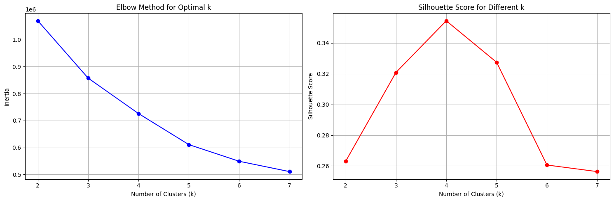
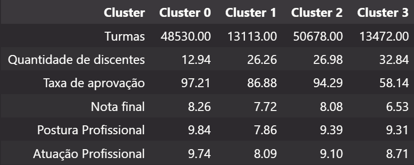

## Evolução de scores ao longo de valores de K

## Clusters gerados para K = 4

## Arquivos
- `clustering.ipynb`contém o código com tratamento de dados e criação de clusters.
- `turmas_com_clusters`contém a relação entre os IDs das turmas e os clusters, será usado para análise mais aprofundada dos clusters.
- `perfil_detalhado_clusters` contempla diversas métricas sobre as variáveis de cada cluster.

## Notas reunião

- Investigar distribuição de tamanho de turmas.
    - Revelar o que é uma turma grande/média/pequena
- Descobrir o que é atuação e postura
- Investigar distribuição de notas de docentes
    - Revelar o que é uma nota boa/média/ruim
- Associar turmas de cada cluster (foco 2 e 3) sobre a área da disciplina